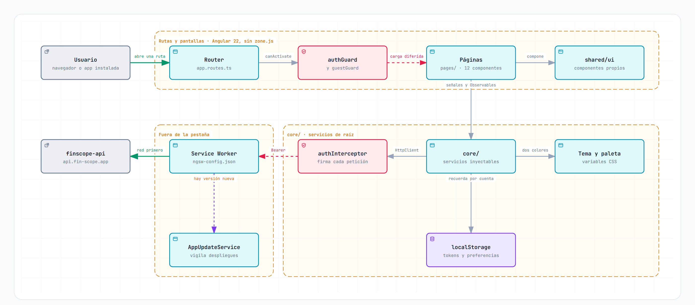
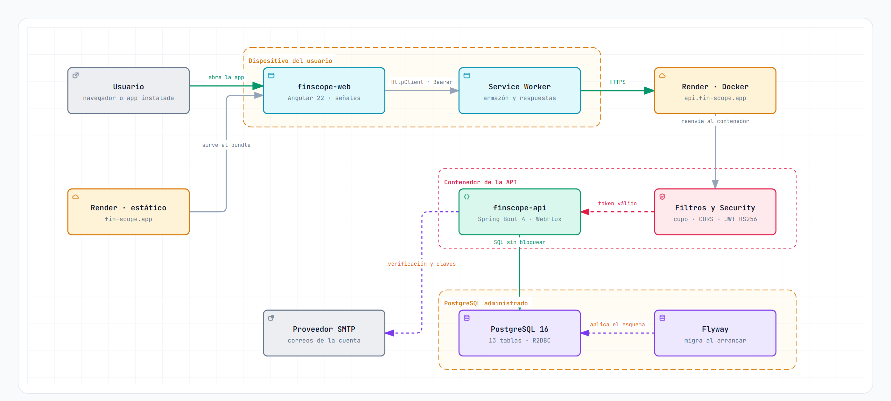

<div align="center">

# FinScope Web

**Aplicación de finanzas personales, instalable en el móvil.** Registra en qué se va el dinero,
lo reparte por categorías y tags, lo compara con un presupuesto mensual y avisa de lo que ya
tiene dueño antes de que acabe el mes.

[](https://angular.dev/)
[](https://www.typescriptlang.org/)
[](https://angular.dev/guide/signals)
[](#instalable-en-el-móvil)
[](#pruebas-y-ci)
[](#qué-es-esto)

[Arquitectura](#arquitectura) · [Pantallas](#las-pantallas) · [Arrancar](#arrancar) ·
[PWA](#instalable-en-el-móvil) · [Aspecto](#tema-y-colores) ·
[API](https://github.com/sebastian-reyes/finscope-api)

</div>

---

## Tabla de contenido

- [Qué es esto](#qué-es-esto)
- [Arquitectura](#arquitectura)
- [Las pantallas](#las-pantallas)
- [Las rutas](#las-rutas)
- [Cómo habla con la API](#cómo-habla-con-la-api)
- [Monedas](#monedas)
- [Instalable en el móvil](#instalable-en-el-móvil)
- [Tema y colores](#tema-y-colores)
- [Estructura del proyecto](#estructura-del-proyecto)
- [Arrancar](#arrancar)
- [Pruebas y CI](#pruebas-y-ci)
- [Despliegue](#despliegue)
- [Cómo cambiar algo](#cómo-cambiar-algo)

---

## Qué es esto

El frontend de [FinScope](https://fin-scope.app). Angular 22 con **señales y componentes
standalone, sin `zone.js`**, servido como estático y consumido desde el móvil como una
aplicación instalada.

Tres decisiones explican casi todo lo demás:

| | |
| --- | --- |
| **Dos dependencias, y contadas** | `chart.js` para los gráficos y `air-datepicker` para el calendario. Ni Bootstrap ni ninguna librería de componentes: el lenguaje visual es propio y vive en cuatro hojas de [`src/styles/`](src/styles). |
| **Todo se carga bajo demanda** | Cada ruta es un `loadComponent`. La primera pantalla no paga por las que no se han abierto. |
| **El contrato manda** | Los modelos de [`core/models.ts`](src/app/core/models.ts) son el espejo del contrato OpenAPI **6.7.0** de la API. Se mantienen a mano para que el proyecto siga siendo sencillo de leer, y son el único punto a tocar cuando el contrato cambia. |

---

## Arquitectura

### La aplicación por dentro

Del toque en la pantalla a la API: el router carga la ruta bajo demanda, un guard resuelve la
sesión, los servicios de `core/` hablan con la API y el interceptor firma cada petición.

<picture>
  <source media="(prefers-color-scheme: dark)" srcset="docs/architecture-frontend.dark.png">
  
</picture>

### El sistema completo

Dos piezas que se despliegan por separado: esta aplicación y una
[API reactiva en Java](https://github.com/sebastian-reyes/finscope-api).

<picture>
  <source media="(prefers-color-scheme: dark)" srcset="docs/architecture-system.dark.png">
  
</picture>

> [!TIP]
> Los dos diagramas son **interactivos**. Descarga
> [`docs/architecture-frontend.html`](docs/architecture-frontend.html) o
> [`docs/architecture-system.html`](docs/architecture-system.html) y ábrelo en el navegador:
> tienen recorridos guiados, búsqueda, foco por componente, tema claro y oscuro y exportación.
> Se generan con [archify](https://github.com/tt-a1i/archify) a partir de los `.json` que hay
> al lado, que son la fuente a editar.

---

## Las pantallas

| Pantalla | Qué resuelve |
| --- | --- |
| **Acceso** | Entrar y crear cuenta en el mismo sitio: cambiar de idea no cuesta una navegación |
| **Enlaces del correo** | Pedir el enlace, elegir contraseña nueva y confirmar un correo. Se llega desde el buzón y sin sesión, así que son tarjetas sueltas sin barra de navegación |
| **Inicio** | El balance del mes, el reparto del gasto, la evolución de los últimos meses, y qué está pasando con presupuestos y fijos |
| **Movimientos** | El historial agrupado por día, con filtros, orden, paginación y totales del periodo |
| **Categorías** | El catálogo que reparte el gasto |
| **Presupuestos** | Un importe por categoría y mes, con su barra |
| **Fijos** | Las plantillas y su estado en el mes que se esté mirando |
| **Tags** | El catálogo de contextos |
| **Mi cuenta** | Nombre, correo con su estado y su cambio, tema y los dos colores |

Las cuatro últimas comparten un marco con un conmutador arriba, porque son cuatro caras del
mismo catálogo y la barra inferior solo tiene cinco huecos.

**El registro es lo que se viene a hacer**, así que es el botón central de la barra inferior y
abre una hoja que sube desde abajo, sin salir de la pantalla en la que se esté.

**La navegación cambia de forma según el sitio.** En móvil es una barra inferior al alcance del
pulgar; en escritorio, una barra superior. Nunca se ven las dos.

<details>
<summary><strong>Los gráficos, y por qué ninguno se apoya solo en el color</strong></summary>

<br>

La serie de evolución lleva leyenda y el desglose rotula cada porción con su nombre. Las
porciones se comprobaron para daltonismo y contraste, y la paleta oscura no es la clara
aclarada, sino un escalonado propio.

Lo que **no** cambia nunca es el verde del ingreso y el rojo del egreso. Son los únicos colores
que informan en vez de decorar; si siguieran al gusto de cada uno dejarían de querer decir lo
que dicen.

</details>

---

## Las rutas

Todas se cargan bajo demanda. `authGuard` deja pasar solo con sesión; `guestGuard` evita volver
al acceso cuando ya la hay.

| Ruta | Guard | Componente |
| --- | --- | --- |
| `/login` | `guestGuard` | Acceso y alta |
| `/forgot-password` | — | Pedir el enlace de restablecimiento |
| `/reset-password` | — | Elegir contraseña nueva |
| `/verify-email` | — | Confirmar el correo |
| `/change-email` | — | Aplicar el cambio de correo |
| `/dashboard` | `authGuard` | Inicio — también la raíz y cualquier ruta desconocida |
| `/transactions` | `authGuard` | Historial |
| `/categories` | `authGuard` | Catálogo de categorías |
| `/budgets` | `authGuard` | Presupuestos del mes |
| `/recurring` | `authGuard` | Movimientos fijos |
| `/tags` | `authGuard` | Catálogo de tags |
| `/account` | `authGuard` | Mi cuenta |

Las cuatro de catálogo cuelgan de una ruta **sin segmento propio**, de modo que conservan sus
direcciones y solo comparten el marco, que es lo que mantiene vivo el conmutador al saltar de
una a otra. Las tres de correo van sin guard a propósito: se llega a ellas justamente cuando no
se puede entrar.

---

## Cómo habla con la API

`FinscopeService` concentra las llamadas y `AuthService` la sesión. Entre medias,
[`auth.interceptor.ts`](src/app/core/auth.interceptor.ts) hace tres cosas:

1. **Firma** cada petición con `Authorization: Bearer <token>`, salvo las cuatro rutas de
   `/auth` que sirven precisamente para obtener credenciales.
2. **Ante un 401, renueva y repite la petición una sola vez.** El token de acceso vive quince
   minutos y el de refresco treinta días, así que la sesión larga es la normal: quedarse
   mirando el historial un rato y luego editar un movimiento caía siempre en un 401. Solo si
   la renovación falla se cierra la sesión de verdad.
3. **Cierra la sesión de forma idempotente.** El token de refresco es de un solo uso y una
   pantalla lanza varias peticiones a la vez, que caducan todas juntas; `AuthService.refreshOnce`
   comparte una única renovación entre todas.

Los mensajes de error salen del cuerpo `ErrorResponse` de la API, que trae un **código estable
de negocio**, así que no hay que inventar textos genéricos. Un `status 0` —la petición no llegó
a contestarse— se explica según el entorno: en local, que falta arrancar el backend; desplegada,
que el servicio puede estar despertando.

---

## Monedas

Un movimiento se guarda **en la moneda en la que ocurrió** y no se convierte nunca: cien
dólares son cien dólares el día que se registran y el día que se consultan. Hay dos admitidas,
`PEN` y `USD`, y **`PEN` es la base**: la que se asume cuando no se indica ninguna y la única
que no lleva tipo de cambio, porque no se convierte a sí misma.

Al registrar fuera de la base hace falta el **tipo de cambio de ese día**, que se guarda junto
al movimiento y no participa en ningún cálculo: es memoria de aquel día, de modo que cuando el
cambio suba, la compra de agosto seguirá valiendo lo que valió. Editar un movimiento no lo
recalcula.

**No hay que teclearlo en cada movimiento.** Al elegir la moneda se propone el último que se
usó en ella, sacado del propio historial —la tasa que el banco aplicó de verdad la última vez,
no la de ninguna fuente externa—, y el campo dice de cuándo es para que una de hace dos semanas
no se dé por buena sin mirarla. De eso se ocupa
[`core/exchange-rate.service.ts`](src/app/core/exchange-rate.service.ts), que pregunta una sola
vez por moneda y se actualiza solo al guardar.

<details>
<summary><strong>Qué se sigue de no convertir nunca</strong></summary>

<br>

- **Ningún total suma monedas distintas.** El balance del inicio y los del historial enseñan una
  cifra por moneda, y el reparto y la evolución llevan un selector, porque un anillo que
  mezclara soles con dólares repartiría porcentajes de una cantidad que no existe. Con una sola
  moneda —lo normal— no aparece ningún selector y todo se ve como siempre.
- **El presupuesto también es de una moneda**, y por eso una categoría puede tener dos planes en
  el mismo mes: S/ 100 y además $ 30. Un gasto en dólares no consume el presupuesto en soles,
  sino el que esa categoría tenga en dólares. Convertirlo haría que el avance de la barra
  dependiera del día en que se mira.
- **El movimiento fijo lleva moneda pero no tipo de cambio.** Se da de alta hoy y se confirma
  dentro de meses, así que el cambio es el del día en que se pague y se pide al confirmarlo. Eso
  es además lo que permite calcular lo comprometido sin convertir nada: cada presupuesto suma
  los fijos de su moneda.

Desde el inicio, un fijo en dólares se marca como pagado con la última tasa conocida. Si todavía
no hay ninguna, esa tarjeta manda a la pantalla de fijos, que es donde se puede escribir: una
tarjeta de un toque no tiene dónde pedirla.

Añadir una moneda —EUR, por ejemplo— es ampliar el enum `Currency` del contrato, la restricción
equivalente de la base y la tabla de símbolos de
[`core/format/money.ts`](src/app/core/format/money.ts).

</details>

---

## Instalable en el móvil

Es una PWA: se instala desde el navegador, **sin pasar por ninguna tienda**. En el iPhone,
*Compartir → Añadir a pantalla de inicio*; en Android, Chrome lo propone solo.

Son dos piezas. [`public/manifest.webmanifest`](public/manifest.webmanifest) declara el nombre,
los iconos y que se abra sin barra de direcciones. El trabajador de servicio, configurado en
[`ngsw-config.json`](ngsw-config.json), cachea el armazón —index, estilos y bundles— **y también
las respuestas de la API**.

### Qué se cachea y con qué estrategia

| Grupo | Qué | Estrategia |
| --- | --- | --- |
| `app`, `iconos`, `assets` | index, estilos, bundles, fuentes e imágenes | `prefetch` |
| `catalogos` | categorías, tags, tipos | `freshness` con **timeout de 2 s** |
| `datos` | perfil, movimientos, presupuestos, fijos | `freshness` **sin timeout** |

Los dos grupos de datos preguntan **primero a la red** y solo tiran de la copia si falla; nunca
`performance`. En una aplicación de dinero, enseñar un saldo viejo como si fuera el de ahora es
peor que no enseñar nada. Por eso el grupo de cifras **no lleva `timeout` a propósito**: solo cae
en la copia cuando la red falla de verdad, que es exactamente cuando la aplicación puede
avisarlo —y lo avisa, con todas las letras—. El de catálogos sí lo lleva, corto: son nombres e
iconos, y que lleguen viejos no engaña a nadie.

La copia se borra al cerrar sesión, porque el trabajador empareja por dirección y no por
credenciales.

<details>
<summary><strong>Tres cosas que no son evidentes</strong></summary>

<br>

- **El trabajador de servicio solo existe en compilaciones de producción**
  (`enabled: !isDevMode()`). Para probarlo hay que compilar y servir el `dist`; con `ng serve`
  no se registra, y es a propósito: una caché que devuelve los bundles de antes mientras
  recompilas es la peor forma posible de perder una tarde.

- **`viewport-fit=cover` en `index.html` sostiene todas las zonas seguras.** Sin él,
  `env(safe-area-inset-*)` vale cero en iOS y la barra inferior acaba bajo la barra de gestos.
  No se toca.

- **Tras desplegar, la versión nueva no entra sola: hay que activarla.** El trabajador sirve lo
  cacheado y descarga lo nuevo por detrás, pero la pestaña abierta se queda en la versión con la
  que arrancó —y en una aplicación instalada eso puede durar días—. De eso se ocupa
  [`core/app-update.service.ts`](src/app/core/app-update.service.ts): pregunta al abrir, cada
  cuarto de hora y cada vez que se vuelve a la aplicación, y cuando hay una lista enciende el
  aviso «Hay una versión nueva» con su botón. La recarga no se hace sola a propósito: puede haber
  una hoja de registro a medio rellenar.

</details>

> [!IMPORTANT]
> El origen de la API vive en **un solo sitio**,
> [`src/environments/api-origin.ts`](src/environments/api-origin.ts). `ngsw-config.json` no
> puede importarlo —es JSON estricto— así que lo repite, y
> [`data-cache.spec.ts`](src/app/core/data-cache.spec.ts) comprueba que los dos dicen lo mismo.
> Sin esa prueba, mudar el servidor a medias no rompe nada visible: la caché sin conexión deja
> de emparejar **en silencio**.

---

## Tema y colores

Claro, oscuro o el del sistema, más **un color principal y uno secundario elegidos por el
usuario**. `system` no escribe un tema fijo: escucha al sistema operativo, de modo que cambiarlo
fuera se nota dentro sin recargar.

Esa elección no se queda en un botón: tiñe los papeles, las líneas y las tintas, gira las ocho
fichas de categorías y tags, reparte las porciones del gráfico y repinta el icono de la
aplicación y el de la pestaña, que **se dibujan y no se cargan**. Cualquier color vale: la
claridad se ajusta con la fórmula de contraste de WCAG hasta que se lea sobre su papel, así que
un amarillo elegido en modo claro se oscurece lo justo en vez de rechazarse.

> [!NOTE]
> **El aspecto se recuerda a nombre de cada cuenta**, no del navegador. Cerrar sesión no vacía
> el `localStorage`, y con una clave suelta la siguiente persona que entrara heredaba el tema y
> los colores de la anterior. La clave sin identificador sigue existiendo y hace dos papeles:
> es la de quien todavía no ha entrado —la pantalla de acceso tiene su propio interruptor— y es
> donde estaba lo guardado antes de que las claves llevaran usuario, de modo que nadie pierde su
> tema oscuro al actualizar.

<details>
<summary><strong>La marca: por qué el icono se recoloreó</strong></summary>

<br>

Los iconos de [`public/icons/`](public/icons) están versionados como binarios; el script que los
derivó del arte original no forma parte del repositorio.

El arte vino en azul marino y verde azulado, que se parecen a los de la aplicación pero no son
los mismos, y **esa distancia corta es justo la que se nota**: dos azules casi iguales uno al
lado del otro se leen como un error, no como una familia.

La baldosa pasa al degradado de `$fs-brand-strong` a `$fs-brand-deep`, los dos escalones hondos
de la marca. No lleva `$fs-brand`, el azul de los botones, y la razón es de contraste: ese azul
está al 44 % de luz y el verde de la aplicación al 27 %, así que una barra verde encima se
difumina —1,1 de contraste, prácticamente invisible—.

La marca suelta (`logo-light.png` y `logo-dark.png`) es el dibujo sin su baldosa, y es lo que
firma la aplicación por dentro: barra superior y acceso. Va en dos versiones porque el trazo del
original es blanco, y la elige la plantilla según el tema resuelto. La baldosa entera se queda
para lo que es de verdad: el icono del sistema. Dentro de una barra blanca era el bloque más
oscuro de la pantalla.

</details>

---

## Estructura del proyecto

```
src/
├── app/
│   ├── core/              servicios de raíz, modelos e interceptor
│   │   ├── auth.*         sesión, guards y firma de peticiones
│   │   ├── finscope.*     las llamadas a la API
│   │   ├── theme/palette  tema, dos colores y variables CSS
│   │   ├── data-cache     vaciar la copia sin conexión
│   │   ├── app-update     vigilar despliegues
│   │   └── format/        dinero, iconos, colores, paletas, periodos
│   ├── shared/ui/         15 componentes propios: editor de movimientos,
│   │                      fichas, selector de categoría, barra de presupuesto,
│   │                      campos de fecha y tags, gráficos
│   ├── pages/             una carpeta por pantalla, todas diferidas
│   ├── app.routes.ts      el mapa de rutas
│   └── app.config.ts      router, HttpClient con interceptor, service worker
├── styles/                _tokens, _reset, _base, _ui, _datepicker
└── environments/          apiUrl por entorno; api-origin.ts es la fuente única
```

Casi todos los archivos abren con un párrafo que cuenta **qué problema resuelve la pieza y qué
alternativa se descartó**. Los comentarios explican el porqué, no el qué.

---

## Arrancar

Necesita la [API](https://github.com/sebastian-reyes/finscope-api) levantada en
`http://localhost:9090`.

```bash
npm install
npm start          # http://localhost:4200
```

[`proxy.conf.mjs`](proxy.conf.mjs) reenvía `/auth`, `/budgets`, `/categories`,
`/recurring-transactions`, `/tags`, `/transactions` y `/transaction-types` al backend, de modo
que **comparten origen y no hay CORS de por medio**.

> [!WARNING]
> Hay direcciones que son a la vez una pantalla y un recurso: `/transactions` es el historial y
> también el listado de la API. Navegando dentro de la aplicación no se nota, porque el router
> cambia la dirección sin pedirle nada al servidor; pero al recargar con F5 el navegador **sí**
> pide ese documento. De ahí el desvío del proxy: lo que se pide como `text/html` se queda en el
> servidor de desarrollo, que devuelve la aplicación; todo lo demás sigue a la API.
>
> **Esa lista de prefijos hay que ampliarla con cada recurso nuevo.** Si falta uno, `HttpClient`
> recibe `index.html` donde esperaba JSON y falla con «Unexpected token `<`» — un fallo que solo
> aparece con `ng serve` y que no ve ninguna prueba.

Otros comandos:

```bash
npm run build      # compilación de producción, en dist/
npm run watch      # compilación de desarrollo en modo vigilancia
npm test           # las 279 pruebas
```

---

## Pruebas y CI

```bash
npx ng test --no-watch     # 35 archivos · 279 pruebas
```

> [!CAUTION]
> **Nunca `npx vitest run`**: sin el `setupFiles` que declara `angular.json`, todas las pruebas
> revientan con «Need to call `TestBed.initTestEnvironment()` first».

[`.github/workflows/ci.yml`](.github/workflows/ci.yml) ejecuta tres pasos en cada empujón a
`master` y en cada pull request:

1. `prettier --check` — lo más rápido y lo más fácil de arreglar, así que va primero.
2. `npm run build` — **no es redundante con las pruebas**: es la única que hace la comprobación
   de tipos de las plantillas con AOT. Un `@if` sobre una propiedad que ya no existe pasa las
   pruebas de los componentes que no la montan y muere aquí.
3. `ng test --no-watch`.

---

## Despliegue

Se sirve como **sitio estático** en Render, con `fin-scope.app` apuntando a él desde Cloudflare.

[`public/_redirects`](public/_redirects) declara la reserva de la SPA: `/* /index.html 200`. Es
una **reescritura, no un redirect** —la dirección se conserva y el router la resuelve— y solo
actúa después de haber agotado los ficheros reales, de modo que los assets con hash siguen
sirviéndose tal cual.

`environment.ts` apunta al **dominio propio** y no al `.onrender.com` del servicio: así, mudar el
backend de sitio es cambiar un registro DNS y no volver a compilar la aplicación —que, con un
trabajador de servicio instalado en los navegadores, tarda en llegar a todo el mundo—.

---

## Cómo cambiar algo

**Un endpoint nuevo** → el tipo en [`core/models.ts`](src/app/core/models.ts), la llamada en
[`core/finscope.service.ts`](src/app/core/finscope.service.ts) y, si es un prefijo nuevo, la
lista de [`proxy.conf.mjs`](proxy.conf.mjs).

**Una pantalla nueva** → una carpeta en `pages/`, una entrada `loadComponent` en
[`app.routes.ts`](src/app/app.routes.ts) y su guard.

**Mudar el backend** → [`src/environments/api-origin.ts`](src/environments/api-origin.ts) **y**
los `dataGroups` de [`ngsw-config.json`](ngsw-config.json). Si los dos se separan, la caché sin
conexión deja de emparejar en silencio; `data-cache.spec.ts` lo impide.

**Un diagrama** → edita el `.json` de `docs/` y vuelve a generar con
[archify](https://github.com/tt-a1i/archify).

---

<div align="center">

**FinScope** · [fin-scope.app](https://fin-scope.app) ·
[finscope-api](https://github.com/sebastian-reyes/finscope-api)

</div>
